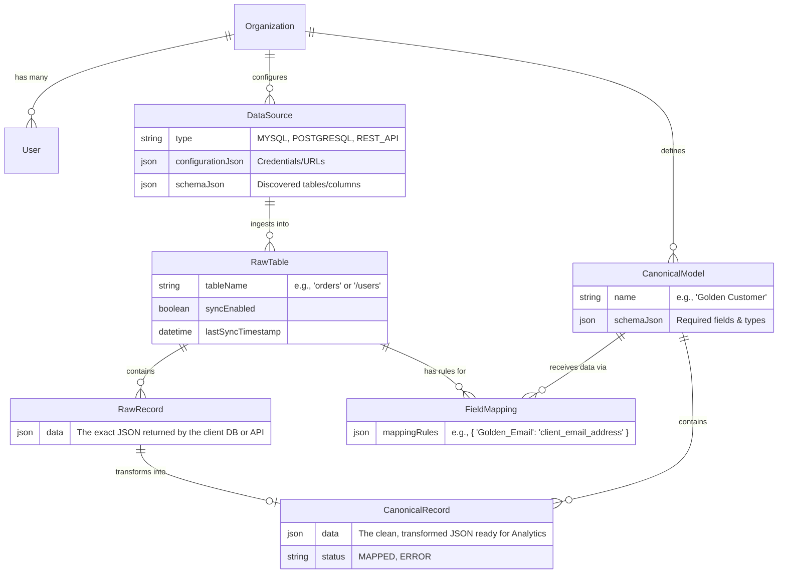

# Backend Database Architecture

Our backend database is designed to handle multi-tenancy, arbitrary data ingestion, and standardized normalization. Here is how the core tables interact with each other.

## Entity Relationship Diagram

## The Data Pipeline Flow

1. **Connection (`DataSource`)**: The client provides credentials or an API base URL. We store this securely in the `DataSource` table.
2. **Discovery (`RawTable`)**: We inspect their database/API and discover all their tables or endpoints. When a user clicks "Enable Sync", we create a `RawTable` record to start tracking it.
3. **Ingestion (`RawRecord`)**: Every 30 seconds, the Sync Engine wakes up. It asks the connector to fetch new rows. Every single row fetched is dumped identically into the `RawRecord` table. The `data` column holds the raw JSON payload exactly as the external system provided it.
4. **Standardization (`CanonicalModel` & `FieldMapping`)**: The user defines a "Golden Schema" (`CanonicalModel`) and maps their messy raw columns to your clean canonical fields (`FieldMapping`).
5. **Transformation (`CanonicalRecord`)**: The Transformation Engine reads the `RawRecord`, applies the `FieldMapping` rules, and saves the perfect, structured result into `CanonicalRecord`. This is what powers your final analytics and charts!
